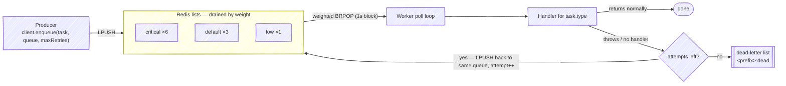
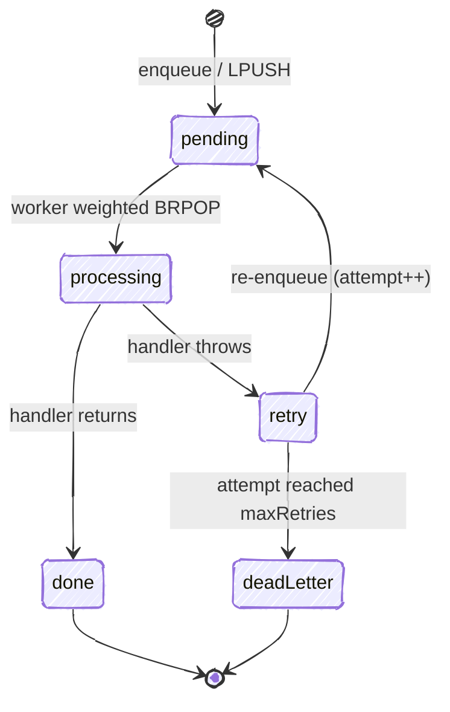

# redis_task_queue


A small Redis-backed task queue for server-side Dart. Enqueue work from your
request path and process it in a separate worker — with retries, a dead-letter
list, and weighted queues so one noisy queue can't starve the others.

If you've used [Asynq](https://github.com/hibiken/asynq) in Go or Sidekiq in
Ruby, the model will feel familiar. Dart server frameworks (Serverpod,
Dart Frog, Shelf) don't have a maintained equivalent, so this fills that gap
with a deliberately small surface.

The path a task takes, end to end:



## Why

Anything slow or retryable — sending email, processing an upload, calling a
flaky third-party API — shouldn't run inside the request. It should go on a
queue and be handled out of band, where a failure can be retried instead of
turning into a 500 the user sees.

That's all this does: a producer drops a task onto Redis and returns
immediately; a worker picks it up, runs it, and retries on failure until it
either succeeds or lands in the dead-letter list.

## Install

```yaml
dependencies:
  redis_task_queue: ^0.1.0
```

## Enqueue (from your request path)

```dart
final client = await QueueClient.connect(); // localhost:6379 by default

await client.enqueue(
  Task('email:welcome', {'user_id': '42'}),
  queue: 'default',
  maxRetries: 5,
);
```

`enqueue` is a single `LPUSH` — keep one client around and reuse it.

## Process (in a separate worker process)

```dart
final worker = await Worker.connect(
  queues: {'critical': 6, 'default': 3, 'low': 1},
);

worker.handle('email:welcome', (task) async {
  // Real work. Throwing triggers a retry; returning marks the task done.
  await sendWelcomeEmail(task.payload['user_id'] as String);
});

await worker.run();
```

## How it behaves

A task moves through a small set of states — it either lands on `done` or, once
retries are exhausted, on the dead-letter list:



- **Weighted queues.** With `{'critical': 6, 'default': 3, 'low': 1}` the worker
  polls `critical` about six times as often as `low`, so a flood of low-priority
  jobs can't starve important ones.
- **Retries.** A handler that throws is retried up to the task's `maxRetries`.
- **Dead-letter list.** Once retries are exhausted, the envelope moves to a
  dead-letter list (`<prefix>:dead`) instead of looping forever, so you can
  inspect what failed.
- **Missing handler = failure.** A task with no registered handler is retried,
  not silently dropped, so a wiring mistake surfaces loudly.

## What this version keeps small (on purpose)

- **Retries are immediate**, not backed off. A production setup would delay
  re-enqueues with an exponential backoff via a sorted set; this keeps the core
  retry path readable. (Planned for a later version.)
- **No scheduler / cron, no unique-task dedup, no web UI.** The goal is the
  enqueue → process → retry → dead-letter core, done clearly.

## Requirements

- Dart 3.5+
- A running Redis instance

## Running the example

```bash
# terminal 1
dart run example/redis_task_queue_example.dart worker
# terminal 2
dart run example/redis_task_queue_example.dart enqueue
```

## License

MIT © Yusuf İhsan Görgel
