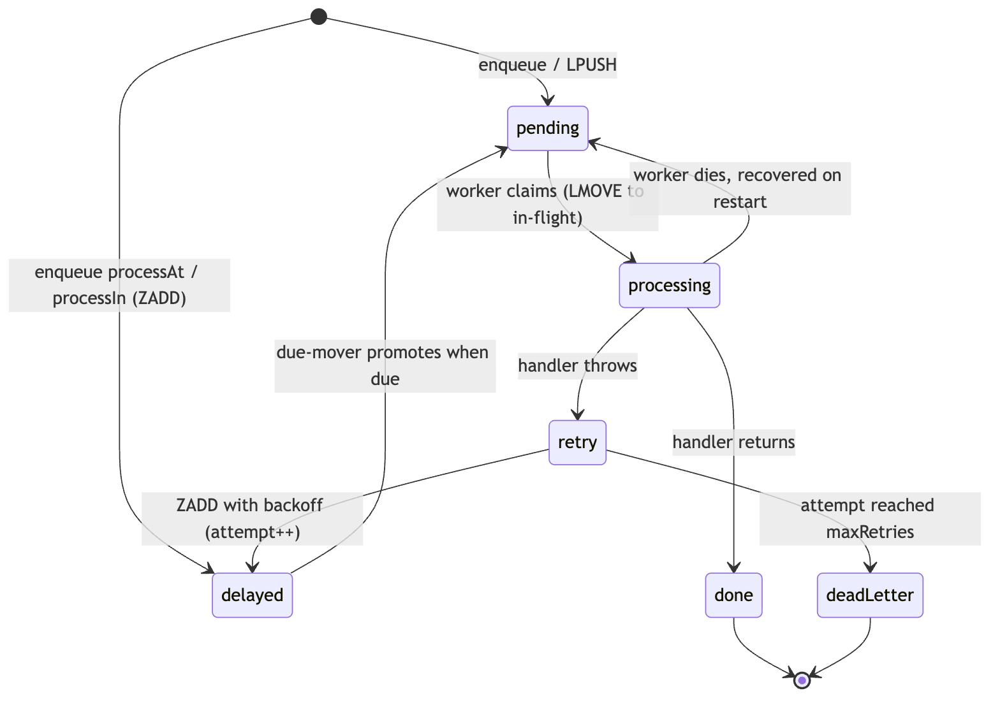

# redis_task_queue


A small Redis-backed task queue for server-side Dart. Enqueue work from your
request path and process it in a separate worker — with retries, a dead-letter
list, weighted queues so one noisy queue can't starve the others, and
crash-safe at-least-once delivery: a task a worker was running when it died is
recovered on restart, not lost.

If you've used [Asynq](https://github.com/hibiken/asynq) in Go or Sidekiq in
Ruby, the model will feel familiar. Dart server frameworks (Serverpod,
Dart Frog, Shelf) don't have a maintained equivalent, so this fills that gap
with a deliberately small surface.

The path a task takes, end to end:


> **Background:** I wrote up the design decisions behind this — porting the Asynq model to Dart, and what I left out — [on my blog](https://yusufihsangorgel.github.io/2026/07/08/asynq-for-dart.html).

## Why

Anything slow or retryable — sending email, processing an upload, calling a
flaky third-party API — shouldn't run inside the request. It should go on a
queue and be handled out of band, where a failure can be retried instead of
turning into a 500 the user sees.

That's all this does: a producer drops a task onto Redis and returns
immediately; a worker picks it up, runs it, and retries on failure until it
either succeeds or lands in the dead-letter list.

## Install

```sh
dart pub add redis_task_queue
```

## Enqueue (from your request path)

```dart
final client = await QueueClient.connect(); // localhost:6379 by default

await client.enqueue(
  Task('email:welcome', {'user_id': '42'}),
  queue: 'default',
  maxRetries: 5,
);
```

`enqueue` is a single `LPUSH` — keep one client around and reuse it.

## Schedule for later

`enqueue` can also hold a task until a future time. Pass `processIn` (a delay
from now) or `processAt` (an absolute time) — one or the other, not both:

```dart
// Run in roughly 15 minutes.
await client.enqueue(
  Task('email:reminder', {'user_id': '42'}),
  processIn: const Duration(minutes: 15),
);

// Run at (or promptly after) a specific moment.
await client.enqueue(
  Task('report:daily', {}),
  processAt: DateTime(2026, 7, 11, 6),
);
```

There is no new machinery behind this: a scheduled task goes into the same
per-queue delayed sorted set the retry backoff uses, scored with its due time,
and the same due-mover promotes it. Two caveats follow from that. The task
starts up to about a second past its due time, plus however long the task the
worker is currently handling takes (the mover runs once per poll-loop pass),
and it only starts while a worker polling that queue is running — with no
worker up, it just waits in the set. A `processAt` in the past runs promptly
on the next mover pass.

## Process (in a separate worker process)

```dart
final worker = await Worker.connect(
  queues: {'critical': 6, 'default': 3, 'low': 1},
  // Optional — these are the defaults. The first retry waits backoffBase,
  // each further retry doubles it up to backoffCap, plus a bit of jitter.
  backoffBase: const Duration(seconds: 1),
  backoffCap: const Duration(seconds: 60),
  backoffJitter: 0.1, // 0..1; fraction of the delay added at random
);

worker.handle('email:welcome', (task, context) async {
  // Real work. Throwing triggers a retry; returning marks the task done.
  //
  // `context` describes this run: `context.id` is the task's id, the same on
  // every attempt and after a crash recovery, so it is what to record against
  // the effect. `context.attempt`, `context.maxAttempts` and
  // `context.isLastAttempt` say where in the retry budget this run sits.
  await sendWelcomeEmail(task.payload['user_id'] as String);
});

await worker.run();
```

To shut down gracefully, on a SIGTERM or a rolling deploy, await `stop()`: it
stops claiming new tasks and returns once the task in progress has finished, so
work is drained rather than abandoned to recovery on the next start.

```dart
await worker.stop();
await worker.close();
```

## How it behaves

A task moves through a small set of states — it either lands on `done` or, once
retries are exhausted, on the dead-letter list:



- **Weighted queues.** With `{'critical': 6, 'default': 3, 'low': 1}` the worker
  gives `critical` first look six times as often as `low` (a rotating cursor
  over the weighted order), so under load the queues are served roughly 6:3:1.
  A flood of low-priority jobs can't starve important ones — and, unlike strict
  priority, a flood of critical jobs can't fully starve `low` either, since it
  still leads one sweep in every ten.
- **Retries with exponential backoff.** A handler that throws is retried up to
  the task's `maxRetries`. Retries aren't immediate: the envelope goes into a
  per-queue delayed sorted set (`<prefix>:queue:<queue>:delayed`) scored with the time
  it becomes due. The wait grows `min(cap, base * 2^(retry-1))` — the first
  retry waits `backoffBase` (default 1s), each further one doubles up to
  `backoffCap` (default 60s) — plus a little jitter so a burst of failures
  doesn't re-fire in lockstep. All three are configurable on `Worker.connect`.
- **Crash-safe at-least-once delivery.** The worker claims a task by atomically
  moving it (`LMOVE`) from its pending list onto a per-worker in-flight list,
  and only removes it from there once the task is done, retried, or
  dead-lettered — each of those transitions is a single Lua step, so the task is
  never off both lists at once. If the worker process dies mid-task (a crash, an
  OOM kill, a lost node), the envelope stays on the in-flight list; on its next
  `run` the worker requeues everything left on its own list and runs it again.
  Nothing is silently lost. The trade is that a task can run more than once (it
  crashed after finishing but before the removal), so **handlers must be
  idempotent** — the same contract as Sidekiq or Asynq. The handler is given
  what it needs to hold up its end: `context.id` is assigned at enqueue and is
  identical on every attempt and every recovery, so it is the key to write
  against the effect. `example/at_least_once.dart` stages the crash and counts
  the result, with and without that defence.
- **Reconnects after a dropped connection.** Neither a `Worker` nor a
  `QueueClient` breaks permanently when the connection to Redis drops (a
  restart, a managed-Redis failover, a proxy's idle timeout): every Redis call
  in both classes retries once through a fresh connection before giving up.
  For `QueueClient`, a call whose retry also fails still throws — Redis is
  genuinely down, not just blipped, and the caller needs to know that. For
  `Worker.run()`, that same failure doesn't end the loop: it backs off,
  reconnects, reruns orphan recovery, and keeps polling, so a dropped
  connection costs a delay, not the worker.
- **Due-mover.** Each poll-loop pass, before it claims the next task, the worker
  promotes any delayed tasks whose score has passed back onto their pending
  list. The move runs inside a single Redis Lua script (`ZRANGEBYSCORE` +
  `ZREM` + `LPUSH`), so it's atomic — a task can't be lost or duplicated, even
  if several workers run the mover at once. Claims use a short (1s) blocking
  wait, so a due task waits at most about a second past its scheduled time.
- **Dead-letter list.** Once retries are exhausted, the task moves to a
  dead-letter list (`<prefix>:dead`) instead of looping forever, stored with the
  error that gave up on it. `QueueClient` reads and manages it: `deadLetters()`
  returns the entries (each a `DeadLetter` with the task, the queue, the error
  text, the attempt count, and when it died), `replayDeadLetter(id)` re-enqueues
  one onto its queue for a fresh set of attempts once you have fixed the cause,
  and `purgeDeadLetters()` clears them out. Nothing drains the list for you, so
  a queue nobody reads is an outage nobody hears about.
- **Missing handler = failure.** A task with no registered handler is retried,
  not silently dropped, so a wiring mistake surfaces loudly.

## Triaging the dead-letter list

```dart
for (final dead in await client.deadLetters()) {
  print('${dead.task.type} ${dead.id} failed: ${dead.error}');
}

// After fixing what broke, send one back for another try:
await client.replayDeadLetter(deadId);

// Or clear entries that are not worth replaying:
await client.purgeDeadLetters();
```

A replay removes the entry and re-enqueues the task in one atomic step, so it
can't be dropped from the dead-letter list without landing back on its queue,
or enqueued twice if two callers replay it at once.

## Seeing how deep the queue is

```dart
final stats = await client.stats();
print('pending ${stats.totalPending}, in flight ${stats.inFlight}, '
    'delayed ${stats.totalDelayed}, dead ${stats.deadLetter}');
print(stats.pending); // {critical: 0, default: 128, low: 12}
```

`stats()` reads counters, not tasks, so it is cheap enough to poll for a
dashboard or a backlog alert: a pending count that only climbs means the workers
are behind, and a dead-letter count that climbs means something is failing for
good. It discovers the active queues with a `SCAN` (never `KEYS`, so it does not
block Redis). Pass `queues: [...]` to count exactly those instead, which also
reports a queue that has no keys yet as zero rather than omitting it.

## Recovery and worker ids

In-flight recovery keys off `workerId` (default: the host name). A restarted
worker reclaims tasks only from its **own** in-flight list, never a live peer's,
so give each worker a stable id that survives a restart — a pod, service, or
host name. In Kubernetes a `StatefulSet` pod name or an explicit `WORKER_ID`
env works well.

The one case this doesn't cover on its own: a worker that dies and is *never*
restarted with the same id (an ephemeral pod that comes back under a fresh
name). Its in-flight list has no owner to reclaim it. If your deployment can do
that, run workers under stable ids, or have a supervisor requeue any
`<prefix>:inflight:*` list belonging to an id that is no longer running.

## What this version keeps small (on purpose)

- **No recurring schedules (cron), no unique-task dedup, no web UI.** One-shot
  scheduling (`processAt` / `processIn`) shipped in 0.3.0; recurring schedules
  are still out. The goal is the enqueue → process → backoff-retry →
  dead-letter core, done clearly.

## Requirements

- Dart 3.5+
- A running Redis instance

## Running the example

```bash
# terminal 1
dart run example/redis_task_queue_example.dart worker
# terminal 2
dart run example/redis_task_queue_example.dart enqueue
```

## License

MIT © Yusuf İhsan Görgel
