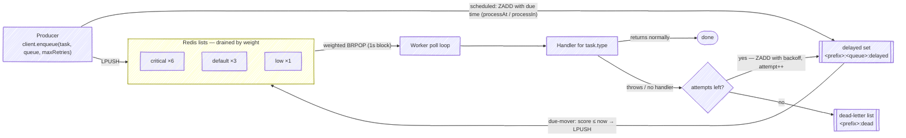
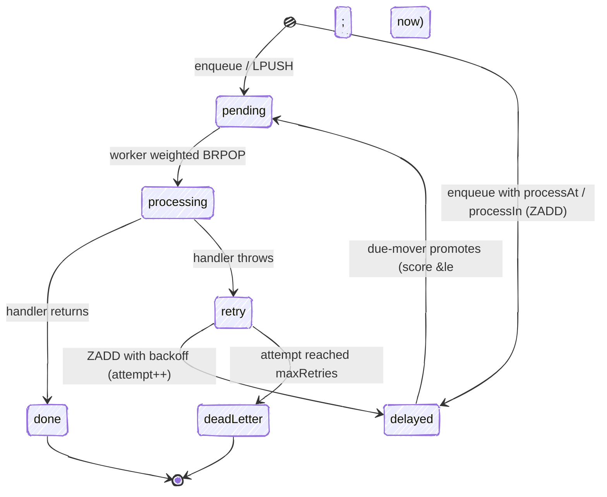

# redis_task_queue


A small Redis-backed task queue for server-side Dart. Enqueue work from your
request path and process it in a separate worker — with retries, a dead-letter
list, and weighted queues so one noisy queue can't starve the others.

If you've used [Asynq](https://github.com/hibiken/asynq) in Go or Sidekiq in
Ruby, the model will feel familiar. Dart server frameworks (Serverpod,
Dart Frog, Shelf) don't have a maintained equivalent, so this fills that gap
with a deliberately small surface.

The path a task takes, end to end:




> **Background:** I wrote up the design decisions behind this — porting the Asynq model to Dart, and what I left out — [on my blog](https://yusufihsangorgel.github.io/2026/07/08/asynq-for-dart.html).

## Why

Anything slow or retryable — sending email, processing an upload, calling a
flaky third-party API — shouldn't run inside the request. It should go on a
queue and be handled out of band, where a failure can be retried instead of
turning into a 500 the user sees.

That's all this does: a producer drops a task onto Redis and returns
immediately; a worker picks it up, runs it, and retries on failure until it
either succeeds or lands in the dead-letter list.

## Install

```yaml
dependencies:
  redis_task_queue: ^0.3.0
```

## Enqueue (from your request path)

```dart
final client = await QueueClient.connect(); // localhost:6379 by default

await client.enqueue(
  Task('email:welcome', {'user_id': '42'}),
  queue: 'default',
  maxRetries: 5,
);
```

`enqueue` is a single `LPUSH` — keep one client around and reuse it.

## Schedule for later

`enqueue` can also hold a task until a future time. Pass `processIn` (a delay
from now) or `processAt` (an absolute time) — one or the other, not both:

```dart
// Run in roughly 15 minutes.
await client.enqueue(
  Task('email:reminder', {'user_id': '42'}),
  processIn: const Duration(minutes: 15),
);

// Run at (or promptly after) a specific moment.
await client.enqueue(
  Task('report:daily', {}),
  processAt: DateTime(2026, 7, 11, 6),
);
```

There is no new machinery behind this: a scheduled task goes into the same
per-queue delayed sorted set the retry backoff uses, scored with its due time,
and the same due-mover promotes it. Two caveats follow from that. The task
starts up to about a second past its due time, plus however long the task the
worker is currently handling takes (the mover runs once per poll-loop pass),
and it only starts while a worker polling that queue is running — with no
worker up, it just waits in the set. A `processAt` in the past runs promptly
on the next mover pass.

## Process (in a separate worker process)

```dart
final worker = await Worker.connect(
  queues: {'critical': 6, 'default': 3, 'low': 1},
  // Optional — these are the defaults. The first retry waits backoffBase,
  // each further retry doubles it up to backoffCap, plus a bit of jitter.
  backoffBase: const Duration(seconds: 1),
  backoffCap: const Duration(seconds: 60),
  backoffJitter: 0.1, // 0..1; fraction of the delay added at random
);

worker.handle('email:welcome', (task) async {
  // Real work. Throwing triggers a retry; returning marks the task done.
  await sendWelcomeEmail(task.payload['user_id'] as String);
});

await worker.run();
```

## How it behaves

A task moves through a small set of states — it either lands on `done` or, once
retries are exhausted, on the dead-letter list:



- **Weighted queues.** With `{'critical': 6, 'default': 3, 'low': 1}` the worker
  polls `critical` about six times as often as `low`, so a flood of low-priority
  jobs can't starve important ones.
- **Retries with exponential backoff.** A handler that throws is retried up to
  the task's `maxRetries`. Retries aren't immediate: the envelope goes into a
  per-queue delayed sorted set (`<prefix>:<queue>:delayed`) scored with the time
  it becomes due. The wait grows `min(cap, base * 2^(retry-1))` — the first
  retry waits `backoffBase` (default 1s), each further one doubles up to
  `backoffCap` (default 60s) — plus a little jitter so a burst of failures
  doesn't re-fire in lockstep. All three are configurable on `Worker.connect`.
- **Due-mover.** Each poll-loop pass, before it blocks on `BRPOP`, the worker
  promotes any delayed tasks whose score has passed back onto their pending
  list. The move runs inside a single Redis Lua script (`ZRANGEBYSCORE` +
  `ZREM` + `LPUSH`), so it's atomic — a task can't be lost or duplicated, even
  if several workers run the mover at once. Because the pop uses a short (1s)
  timeout, a due task waits at most about a second past its scheduled time.
- **Dead-letter list.** Once retries are exhausted, the envelope moves to a
  dead-letter list (`<prefix>:dead`) instead of looping forever, so you can
  inspect what failed.
- **Missing handler = failure.** A task with no registered handler is retried,
  not silently dropped, so a wiring mistake surfaces loudly.

## What this version keeps small (on purpose)

- **No in-flight tracking.** A task is popped with `BRPOP`, so if a worker
  crashes between the pop and finishing (or re-scheduling) the task, that task
  is lost — there's no processing set or visibility timeout to recover it. The
  delayed-retry mover itself is atomic and safe across workers; this caveat is
  about the pop/handle step, and it's out of scope for this version.
- **No recurring schedules (cron), no unique-task dedup, no web UI.** One-shot
  scheduling (`processAt` / `processIn`) shipped in 0.3.0; recurring schedules
  are still out. The goal is the enqueue → process → backoff-retry →
  dead-letter core, done clearly.

## Requirements

- Dart 3.5+
- A running Redis instance

## Running the example

```bash
# terminal 1
dart run example/redis_task_queue_example.dart worker
# terminal 2
dart run example/redis_task_queue_example.dart enqueue
```

## License

MIT © Yusuf İhsan Görgel
